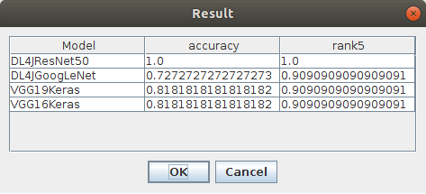

# DeepCompareJ
DeepCompareJ is a Java application that allows users to easily compare models from different deep learning frameworks without worrying about the particularities of each library. Users of this project can test different models and frameworks with several measures to solve their problems.

This Java appplication uses [DeepClas4Bio API](https://github.com/adines/DeepClas4Bio), an API that aims to facilitate the interoperability of bioimaging tools with deep learning frameworks, to compare different models.

## Requirements
To use DeepCompareJ is necessary to have installed Java 8 and download the [DeepClas4Bio API](https://github.com/adines/DeepClas4Bio).

## Example
DeepCompareJ uses DeepClas4Bio API, so when DeepCompareJ starts, the users have to select the path of the DeepClas4Bio API. Then DeepCompareJ connects with DeepClas4Bio API to obtain all necessary information. 

The interface of the Java application is the following:

Here the users can manage the models and frameworks they want to compare. For this task, the users have three options:

 - Add model: To add a pair framework-model to the list to compare.
 - Delete model: To remove one pair framework-model from the list to compare.
 - Delete all models: To clean the list to compare.

The users also can select the measures used to compare the models. As in the previous case, the users have three options:

 - Add measure: To add a measure to the list of measures to use.
 - Delete measure: To remove one measure from the list of measures to use.
 - Delete all measures: To clean the list of measures to use.

And finally, the users can manage the DataSet they want use. Here the users can select the way to load the DataSet (for example he API loads datasets from a folder where each class has its corresponding folder of images), the path of the DataSet and the text file where they have the different classes of the model.

Once the users have selected the models they want to compare, the measures they wnat to use and the DataSet they want to evaluate, DeepCompareJ connects with the DeepClas4Bio API to compare the selected models. The results of the comparison are presented in a table.

